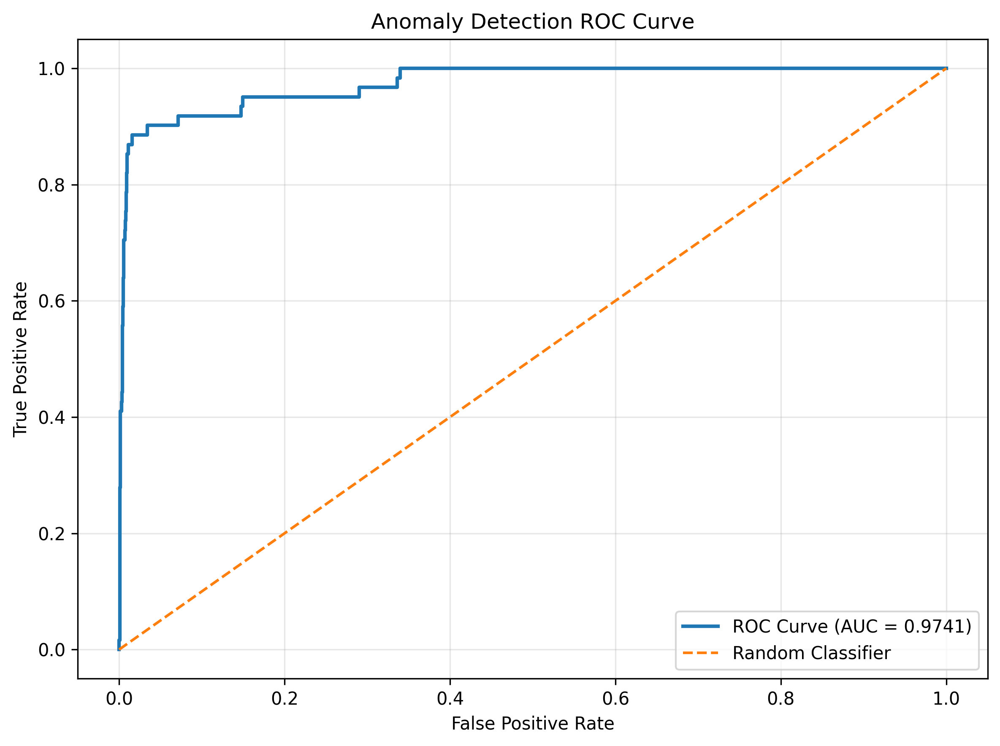

# Deep Learning Credit Card Anomaly Detection

An anomaly detection project based on deep autoencoders implemented with TensorFlow/Keras.

## Technologies

* Python 3.10
* TensorFlow / Keras
* Scikit-Learn
* Pandas
* NumPy
* Matplotlib

## Dataset

The project uses a credit card transaction dataset containing normal and anomalous transactions.

Target variable:

```text
Class
```

* 0 — Normal Transaction
* 1 — Anomalous Transaction

## Features

### Data Preprocessing

* Dataset loading using Pandas
* Feature standardization using StandardScaler
* Training set creation using only normal transactions

### Autoencoder Architecture

Encoder:

```text
Input (29)
 ├── Dense(32, ReLU)
 ├── BatchNormalization
 ├── Dropout(0.2)
 └── Dense(14, ReLU)
```

Decoder:

```text
Dense(32, ReLU)
BatchNormalization
Dropout(0.2)
Dense(29, Linear)
```

### Model Training

* Adam Optimizer
* Mean Squared Error (MSE) Loss
* Validation Split
* Mini-batch Training

### Anomaly Detection

* Transaction reconstruction
* Reconstruction error calculation (MSE)
* 95th percentile threshold selection
* Binary anomaly classification

### Model Evaluation

* ROC-AUC Score
* Classification Report
* ROC Curve

## Project Structure

```text
DeepLearningCreditCardAnomalyDetection/
│
├── data/
│   └── creditcard.csv
│
├── figures/
│   └── roc_curve.png
│
├── src/
│   └── credit_card_anomaly_detection.py
│
├── requirements.txt
└── README.md
```

## Installation

```bash
git clone https://github.com/karolinasniezek/deep-learning-credit-card-anomaly-detection.git

cd DeepLearningCreditCardAnomalyDetection

python3.10 -m venv .venv

source .venv/bin/activate

pip install --upgrade pip
pip install -r requirements.txt
```

## Run

```bash
python src/credit_card_anomaly_detection.py
```

## Results

### ROC Curve



The ROC curve visualizes the relationship between the True Positive Rate and False Positive Rate across different anomaly detection thresholds.
